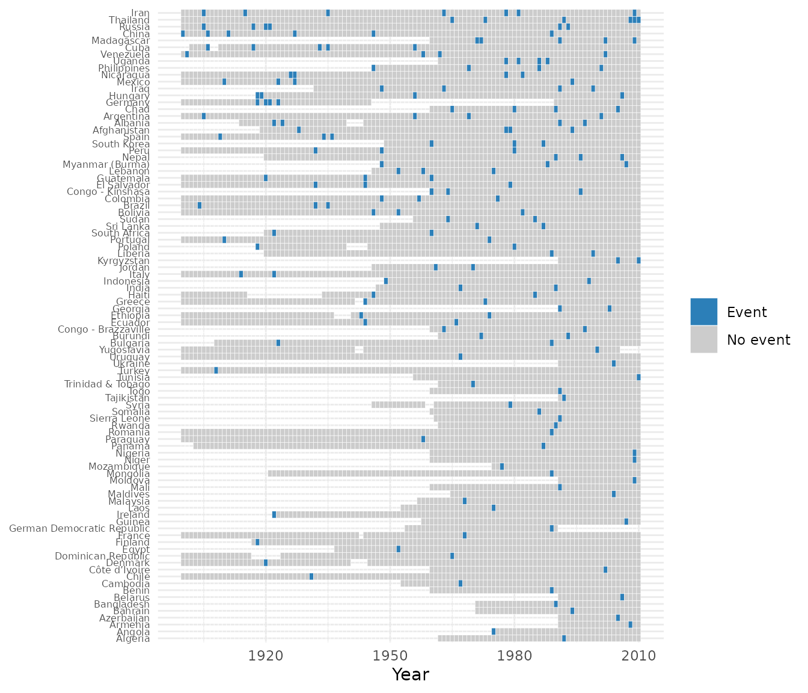

# Usage example: modeling revolutionary onset

This walks through a complete workflow with `contentiousR`: construct a
country-year panel from several sources, check its coverage, and
estimate a rare-events logit of revolutionary onset. It is rather a
demonstration of package mechanics than a substantive research claim —
the model below is illustrative and has not been vetted as a serious
specification.

## Construct the panel

``` r

library(contentiousR)
library(dplyr)
#> 
#> Attaching package: 'dplyr'
#> The following objects are masked from 'package:stats':
#> 
#>     filter, lag
#> The following objects are masked from 'package:base':
#> 
#>     intersect, setdiff, setequal, union

panel <- build_states_panel(1900, 2010, coding_system = "cow") |>
  add_gdp(dataset = "fariss") |>
  add_population(dataset = "wpp") |>
  add_vdem(vars = c("v2x_polyarchy", "v2x_libdem", "v2x_execorr")) |>
  add_leader_data(dataset = "archigos") |>
  add_military_expenditure(dataset = "nmc") |>
  add_conflict(dataset = "beissinger", aggregate = TRUE) |>
  select(
    cow, year, country, fariss_gdppc, wpp_pop, nmc_milex,
    v2x_polyarchy, v2x_execorr, leader_tenure, beissinger_onset
  ) |>
  mutate(across(starts_with("beissinger_"), ~ tidyr::replace_na(.x, 0))) |> # fill non-onsets with zeros
  add_spell_duration() |>
  add_lag(
    vars = c(
      "fariss_gdppc", "wpp_pop", "v2x_polyarchy",
      "v2x_execorr", "leader_tenure", "nmc_milex"
    ),
    n = 1
  )
#> Multiple campaigns or episodes per country-year detected in 'beissinger'. Aggregating to country-year using max() for numeric columns. Use `aggregate = FALSE` or `conflict_data()` for record-level data.

dim(panel)
#> [1] 11257    17
```

``` r

head(panel) |>
  mutate(across(where(is.numeric), ~ round(.x, 2))) |>
  knitr::kable()
```

| cow | year | country | fariss_gdppc | wpp_pop | nmc_milex | v2x_polyarchy | v2x_execorr | leader_tenure | beissinger_onset | beissinger_spell | fariss_gdppc_l | wpp_pop_l | v2x_polyarchy_l | v2x_execorr_l | leader_tenure_l | nmc_milex_l |
|---:|---:|:---|---:|---:|---:|---:|---:|---:|---:|---:|---:|---:|---:|---:|---:|---:|
| 2 | 1900 | United States | 17.37 | NA | 41481 | 0.42 | 0.06 | 4 | 0 | 0 | NA | NA | NA | NA | NA | NA |
| 2 | 1901 | United States | 18.07 | NA | 36087 | 0.42 | 0.06 | 1 | 0 | 1 | 17.37 | NA | 0.42 | 0.06 | 4 | 41481 |
| 2 | 1902 | United States | 18.44 | NA | 39722 | 0.42 | 0.06 | 2 | 0 | 2 | 18.07 | NA | 0.42 | 0.06 | 1 | 36087 |
| 2 | 1903 | United States | 18.69 | NA | 43814 | 0.42 | 0.06 | 3 | 0 | 3 | 18.44 | NA | 0.42 | 0.06 | 2 | 39722 |
| 2 | 1904 | United States | 18.74 | NA | 47918 | 0.42 | 0.06 | 4 | 0 | 4 | 18.69 | NA | 0.42 | 0.06 | 3 | 43814 |
| 2 | 1905 | United States | 19.34 | NA | 45098 | 0.42 | 0.06 | 5 | 0 | 5 | 18.74 | NA | 0.42 | 0.06 | 4 | 47918 |

`add_conflict(dataset = "beissinger", aggregate = TRUE)` is used rather
than `aggregate = FALSE`: Revolutionary Episodes Dataset is an episode
dataset, and a handful of country-years have more than one recorded
episode (e.g. Germany in 1918). Left unaggregated, those country-years
would produce duplicate `cow`-`year` rows. `replace_na(0)` treats “not
covered” as “no onset” so that
[`add_spell_duration()`](https://rguseinov.github.io/contentiousR/reference/add_spell_duration.md)
(which cannot span `NA`) can compute a peace-years counter
(`beissinger_spell`) across the whole panel. This is a modeling choice,
not a neutral default.

## Check coverage

``` r

plot_coverage(panel, "beissinger_onset", drop_empty = TRUE)
```



## Model onset

Onsets are rare, which biases a regular logit model. The model below
uses `brglm2`’s Jeffreys-prior penalized likelihood
(`method = "brglmFit"`, `type = "MPL_Jeffreys"`) instead (see Kosmidis
and Firth 2009), with a natural spline on `beissinger_spell` to flexibly
control for time since the last episode and year fixed effects. One-year
lagged controls are included in the estimation.

``` r

library(brglm2)

model <- glm(
  beissinger_onset ~ log(fariss_gdppc_l + 0.1) + wpp_pop_l +
    v2x_polyarchy_l + I(v2x_polyarchy_l^2) + v2x_execorr_l +
    leader_tenure_l + I(leader_tenure_l^2) + nmc_milex_l +
    splines::bs(beissinger_spell, 3) + as.factor(year),
  family = binomial("logit"),
  method = "brglmFit", type = "MPL_Jeffreys",
  data = panel
)

co <- summary(model)$coefficients
co[!grepl("factor\\(year\\)", rownames(co)), ]
#>                                        Estimate   Std. Error     z value
#> (Intercept)                       -5.482900e+00 1.497199e+00 -3.66210390
#> log(fariss_gdppc_l + 0.1)         -8.628873e-03 1.002608e-01 -0.08606431
#> wpp_pop_l                          7.575049e-07 5.515177e-07  1.37349167
#> v2x_polyarchy_l                    4.364033e+00 1.714333e+00  2.54561586
#> I(v2x_polyarchy_l^2)              -7.591873e+00 2.130573e+00 -3.56330178
#> v2x_execorr_l                      8.857624e-01 3.717666e-01  2.38257635
#> leader_tenure_l                    4.086467e-02 3.080982e-02  1.32635229
#> I(leader_tenure_l^2)              -1.291432e-03 9.784392e-04 -1.31989015
#> nmc_milex_l                        1.178253e-09 4.467392e-09  0.26374516
#> splines::bs(beissinger_spell, 3)1 -1.050117e+00 9.028635e-01 -1.16309592
#> splines::bs(beissinger_spell, 3)2  2.162076e+00 1.149534e+00  1.88082880
#> splines::bs(beissinger_spell, 3)3 -9.603299e-01 1.364815e+00 -0.70363383
#>                                       Pr(>|z|)
#> (Intercept)                       0.0002501524
#> log(fariss_gdppc_l + 0.1)         0.9314152969
#> wpp_pop_l                         0.1695995501
#> v2x_polyarchy_l                   0.0109085156
#> I(v2x_polyarchy_l^2)              0.0003662193
#> v2x_execorr_l                     0.0171919666
#> leader_tenure_l                   0.1847230325
#> I(leader_tenure_l^2)              0.1868716962
#> nmc_milex_l                       0.7919762910
#> splines::bs(beissinger_spell, 3)1 0.2447905889
#> splines::bs(beissinger_spell, 3)2 0.0599952109
#> splines::bs(beissinger_spell, 3)3 0.4816608407
```

Year fixed effects are omitted from the printed table above for
readability.

## Reference

Kosmidis, I., and D. Firth. 2009. “Bias Reduction in Exponential Family
Nonlinear Models.” Biometrika 96 (4): 793–804.
<https://doi.org/10.1093/biomet/asp055>.
