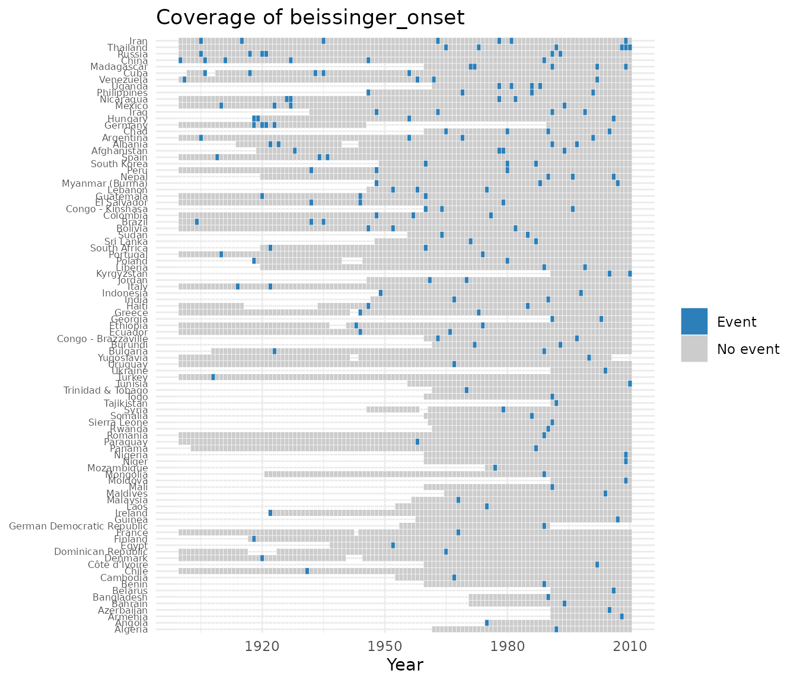

# Case study: modeling revolutionary onset

This walks through a complete workflow with `contentiousR`: assemble a
country-year panel from several sources, check its coverage, and fit a
rare-events logit of revolutionary onset. It is a demonstration of
package mechanics, not a substantive research claim — the model below is
illustrative and has not been vetted as a serious specification.

## Assemble the panel

``` r

library(contentiousR)
library(dplyr)
#> 
#> Attaching package: 'dplyr'
#> The following objects are masked from 'package:stats':
#> 
#>     filter, lag
#> The following objects are masked from 'package:base':
#> 
#>     intersect, setdiff, setequal, union

panel <- build_states_panel(1900, 2010, coding_system = "cow") |>
  add_gdp(dataset = "fariss") |>
  add_population(dataset = "wpp") |>
  add_vdem(vars = c("v2x_polyarchy", "v2x_libdem", "v2x_execorr")) |>
  add_leader_data(dataset = "archigos") |>
  add_military_expenditure(dataset = "nmc") |>
  add_conflict(dataset = "beissinger", aggregate = TRUE) |>
  select(
    cow, year, country, fariss_gdppc, wpp_pop, nmc_milex,
    v2x_polyarchy, v2x_execorr, leader_tenure, beissinger_onset
  ) |>
  mutate(across(starts_with("beissinger_"), ~ tidyr::replace_na(.x, 0))) |>
  add_spells() |>
  add_lag(
    vars = c(
      "fariss_gdppc", "wpp_pop", "v2x_polyarchy",
      "v2x_execorr", "leader_tenure", "nmc_milex"
    ),
    n = 1
  )
#> Multiple campaigns or episodes per country-year detected in 'beissinger'. Aggregating to country-year using max() for numeric columns. Use `aggregate = FALSE` or `conflict_data()` for record-level data.

dim(panel)
#> [1] 11257    17
```

`add_conflict(dataset = "beissinger", aggregate = TRUE)` is used rather
than `aggregate = FALSE`: Beissinger is a legacy episode dataset, and a
handful of country-years have more than one recorded episode
(e.g. Germany in 1918). Left unaggregated, those country-years would
produce duplicate `cow`-`year` rows, which breaks the
one-row-per-state-year assumption that
[`add_spells()`](https://rguseinov.github.io/contentiousR/reference/add_spells.md)
and
[`add_lag()`](https://rguseinov.github.io/contentiousR/reference/add_lag.md)
both rely on. Aggregating collapses these to a single row per
country-year with a missing-safe maximum, which is exactly what a binary
onset indicator needs. `beissinger_onset` still has `NA` for
country-years the source doesn’t cover at all; `replace_na(0)` treats
“not covered” as “no onset” so that
[`add_spells()`](https://rguseinov.github.io/contentiousR/reference/add_spells.md)
(which cannot span `NA`) can compute a peace-years counter
(`beissinger_spell`) across the whole panel. This is a modeling choice,
not a neutral default — it assumes the absence of a recorded episode
means no revolution occurred, which will not be true for every gap in
the source’s coverage.

## Check coverage

``` r

plot_coverage(panel, "beissinger_onset", drop_empty = TRUE)
```



## Model onset

Onsets are rare, which biases ordinary maximum-likelihood logit. The
model below uses `brglm2`’s Jeffreys-prior penalized likelihood
(`method = "brglmFit"`, `type = "MPL_Jeffreys"`) instead, with a natural
spline on `beissinger_spell` to flexibly control for time since the last
episode (a standard alternative to cubic-spline peace-years terms in
duration models) and year fixed effects.

``` r

library(brglm2)

model <- glm(
  beissinger_onset ~ log(fariss_gdppc_l + 0.1) + wpp_pop_l +
    v2x_polyarchy_l + I(v2x_polyarchy_l^2) + v2x_execorr_l +
    leader_tenure_l + I(leader_tenure_l^2) + nmc_milex_l +
    splines::bs(beissinger_spell, 3) + as.factor(year),
  family = binomial("logit"),
  method = "brglmFit", type = "MPL_Jeffreys",
  data = panel
)

co <- summary(model)$coefficients
co[!grepl("factor\\(year\\)", rownames(co)), ]
#>                                        Estimate   Std. Error     z value
#> (Intercept)                       -5.479410e+00 1.497253e+00 -3.65964194
#> log(fariss_gdppc_l + 0.1)         -1.603188e-02 1.006870e-01 -0.15922487
#> wpp_pop_l                          7.679461e-07 5.512076e-07  1.39320670
#> v2x_polyarchy_l                    4.370538e+00 1.703268e+00  2.56597206
#> I(v2x_polyarchy_l^2)              -7.623053e+00 2.113901e+00 -3.60615474
#> v2x_execorr_l                      8.957704e-01 3.729414e-01  2.40190637
#> leader_tenure_l                    4.145870e-02 3.085531e-02  1.34364884
#> I(leader_tenure_l^2)              -1.289695e-03 9.785908e-04 -1.31791026
#> nmc_milex_l                        1.129747e-09 4.255478e-09  0.26548063
#> splines::bs(beissinger_spell, 3)1 -9.449546e-01 9.012564e-01 -1.04848587
#> splines::bs(beissinger_spell, 3)2  1.770707e+00 1.147905e+00  1.54255569
#> splines::bs(beissinger_spell, 3)3 -3.666374e-02 1.383359e+00 -0.02650342
#>                                       Pr(>|z|)
#> (Intercept)                       0.0002525679
#> log(fariss_gdppc_l + 0.1)         0.8734917070
#> wpp_pop_l                         0.1635572936
#> v2x_polyarchy_l                   0.0102887116
#> I(v2x_polyarchy_l^2)              0.0003107679
#> v2x_execorr_l                     0.0163098822
#> leader_tenure_l                   0.1790619673
#> I(leader_tenure_l^2)              0.1875336897
#> nmc_milex_l                       0.7906392285
#> splines::bs(beissinger_spell, 3)1 0.2944148108
#> splines::bs(beissinger_spell, 3)2 0.1229386164
#> splines::bs(beissinger_spell, 3)3 0.9788558075
```

Year fixed effects are omitted from the printed table above for
readability; they are still in the fitted model.
