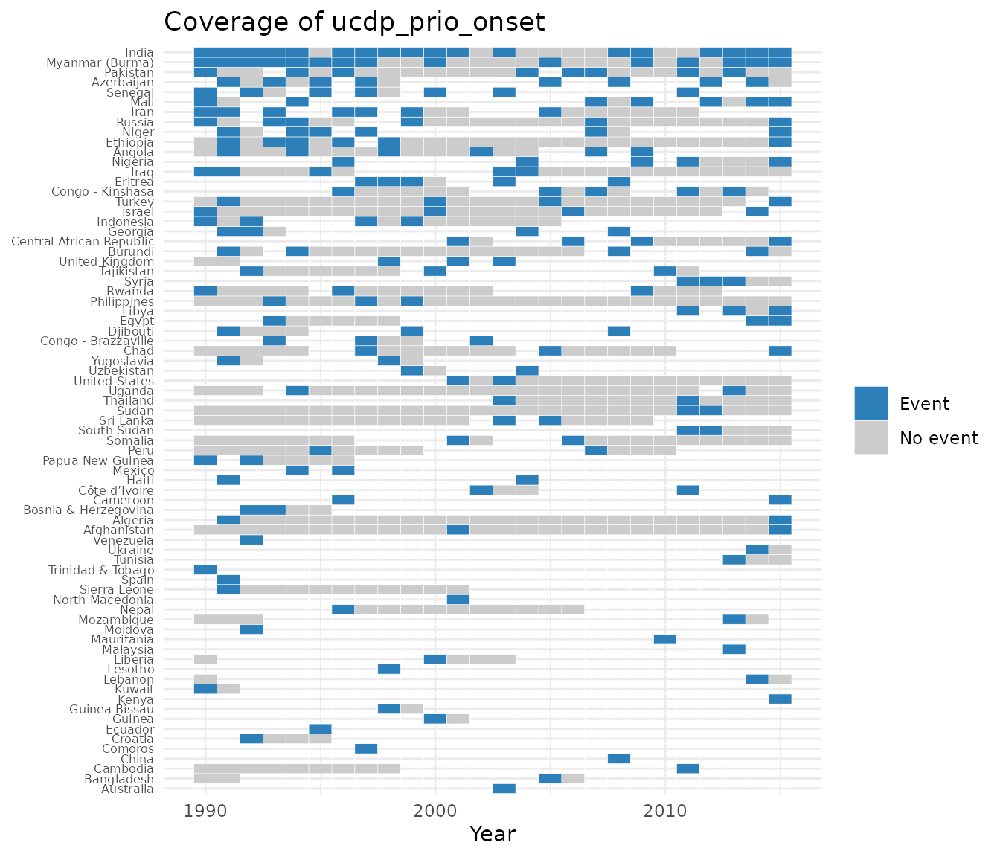

# Get started with contentiousR

`contentiousR` creates reproducible country-year panels for contentious
politics and civil conflicts research. Every public loader supports
Correlates of War (`"cow"`) and Gleditsch-Ward (`"gw"`) country codes.

## Build and enrich a panel

Start with the universe of states, then add data with left joins. The
add functions infer the coding system and requested years from the
panel.

``` r

library(contentiousR)

panel <- build_states_panel(
  start_year = 2000,
  end_year = 2002,
  coding_system = "cow"
)

analysis_data <- panel |>
  add_gdp() |>
  add_conflict("ucdp_prio") |>
  add_leader_data("archigos")

analysis_data[1:4, c(
  "country", "year", "gdp_pcap", "ucdp_prio_incidence", "leader"
)]
#>         country year gdp_pcap ucdp_prio_incidence    leader
#> 1 United States 2000 55889.52                  NA   Clinton
#> 2 United States 2001 55783.75                   1 G.W. Bush
#> 3 United States 2002 56127.44                   1 G.W. Bush
#> 4        Canada 2000 48531.95                  NA  Chretien
```

An unmatched row remains `NA`. This is deliberate: a source may not
cover a country-year, and lack of a match should not automatically be
interpreted as zero events.

## Load data separately

Standalone loaders are useful when you want to inspect or aggregate data
before joining them.

``` r

conflicts <- conflict_data(
  start_year = 2000,
  end_year = 2002,
  dataset = "ucdp_prio",
  coding_system = "gw"
)

head(conflicts)
#> # A tibble: 6 × 13
#>      gw  year ucdp_prio_incidence ucdp_prio_onset ucdp_prio_n_conflicts
#>   <int> <dbl>               <int>           <int>                 <int>
#> 1     2  2001                   1               1                     2
#> 2     2  2002                   1               0                     1
#> 3   100  2000                   1               0                     1
#> 4   100  2001                   1               0                     1
#> 5   100  2002                   1               0                     1
#> 6   200  2001                   1               1                     1
#> # ℹ 8 more variables: ucdp_prio_intensity_max <int>, ucdp_prio_war <int>,
#> #   ucdp_prio_cumulative_intensity <int>, ucdp_prio_type_max <int>,
#> #   ucdp_prio_intrastate <int>, ucdp_prio_interstate <int>,
#> #   ucdp_prio_incompatibility_max <int>, ucdp_prio_ep_end <int>
```

UCDP/PRIO distinguishes active conflict-years (`ucdp_prio_incidence`)
from the first year of an episode (`ucdp_prio_onset`). See
[`vignette("data-sources", package = "contentiousR")`](https://rguseinov.github.io/contentiousR/articles/data-sources.md)
before interpreting any source-specific variable.

## Conflict spells (peace-years)

[`add_spells()`](https://rguseinov.github.io/contentiousR/reference/add_spells.md)
turns a binary conflict column into a duration counter — years since the
last event for that state, restarting after each new one. This is the
same construct as
[`peacesciencer::add_spells()`](https://rdrr.io/pkg/peacesciencer/man/add_spells.html),
useful as a control for temporal dependence in event-history models
(e.g. with cubic splines). It needs a column without `NA`, so filter
first:

``` r

spell_data <- build_states_panel(1990, 2005, coding_system = "gw") |>
  add_conflict("ucdp_prio") |>
  tidyr::drop_na(ucdp_prio_onset) |>
  add_spells(event = "ucdp_prio_onset")

spell_data[spell_data$gw == 2, c("gw", "year", "ucdp_prio_onset", "ucdp_prio_spell")]
#>   gw year ucdp_prio_onset ucdp_prio_spell
#> 1  2 2001               1               0
#> 2  2 2002               0               0
#> 3  2 2003               1               1
#> 4  2 2004               0               0
#> 5  2 2005               0               1
```

If `event` is omitted,
[`add_spells()`](https://rguseinov.github.io/contentiousR/reference/add_spells.md)
looks for exactly one column ending in `_onset`, `_incidence`, or
`_ongoing` and uses that; it errors if none or several are found.
`_onset`-style columns treat every `1` as an independent event by
default; `_incidence`/`_ongoing`-style columns collapse a run of
consecutive `1`s into one event, leaving the continuation years `NA` in
the output (override this with the `ongoing` argument).

## Lagged variables

[`add_lag()`](https://rguseinov.github.io/contentiousR/reference/add_lag.md)
adds a lagged version of one or more columns, computed within each state
after sorting by year — grouping by state before lagging is essential in
panel data, otherwise a lag could pull in another country’s value.
Unlike a plain
[`dplyr::lag()`](https://dplyr.tidyverse.org/reference/lead-lag.html),
it checks that the preceding row is genuinely `n` years earlier, so a
gap in the year sequence produces `NA` rather than silently reaching
further back than intended:

``` r

build_states_panel(1990, 1995, coding_system = "cow") |>
  add_gdp() |>
  add_lag(vars = c("gdp_pcap", "gdp_growth"), n = 1) |>
  dplyr::filter(cow == 2) |>
  dplyr::select(cow, year, gdp_pcap, gdp_pcap_l, gdp_growth_l)
#> # A tibble: 6 × 5
#>     cow  year gdp_pcap gdp_pcap_l gdp_growth_l
#>   <dbl> <dbl>    <dbl>      <dbl>        <dbl>
#> 1     2  1990   45755.        NA         NA   
#> 2     2  1991   45035.     45755.         3.18
#> 3     2  1992   45912.     45035.        -1.58
#> 4     2  1993   46485.     45912.         1.95
#> 5     2  1994   47696.     46485.         1.25
#> 6     2  1995   48326.     47696.         2.60
```

Each requested variable gets one new column named `<var>_l`. Call
[`add_lag()`](https://rguseinov.github.io/contentiousR/reference/add_lag.md)
again (optionally with a different `n`) for additional lags.

## Visualizing onsets

[`plot_coverage()`](https://rguseinov.github.io/contentiousR/reference/plot_coverage.md)
draws a state-by-year heatmap of a binary (0/1) event column: `1` years
are shaded as an event, `0` years as no event, and years where the
source has no data — either `var` is `NA`, or the state does not appear
in the panel that year at all, e.g. before independence — are left
blank. States that never have the event are dropped by default
(`drop_empty = TRUE`), since an all-blank/grey row adds clutter without
showing where events actually happened.

``` r

if (requireNamespace("ggplot2", quietly = TRUE)) {
  build_states_panel(1990, 2015, coding_system = "cow") |>
    add_conflict("ucdp_prio") |>
    plot_coverage("ucdp_prio_onset")
}
```



`ucdp_prio` is used here rather than, say, `scad`, because its `onset`
column has a genuine `0`: `add_conflict("ucdp_prio")` codes every
country-year with an *active* conflict as either a fresh episode (`1`)
or a continuation of one already under way (`0`), so both colors
actually appear. `scad_onset` (and similarly `beissinger_onset`) only
has rows for country-years with at least one recorded event — there is
no explicit “we checked and found nothing” `0` — so plotting it directly
shows just `Event` and blank, never grey. The [case study
article](https://rguseinov.github.io/contentiousR/articles/case-study.md)
turns that `NA` into an explicit `0` with `replace_na()` before plotting
`beissinger_onset`, which is a modeling assumption (absence of a
recorded event means no event), not a neutral default.

## Optional V-Dem data

V-Dem is not bundled and its R data package is not on CRAN. Install it
from its official repository, then request only the indicators you need:

``` r

remotes::install_github("vdeminstitute/vdemdata")

panel |>
  add_vdem(c("v2x_polyarchy", "v2x_libdem"))
```

## `build_states_panel()`

Creates a state-year panel with optional filters:

``` r

panel <- build_states_panel(
  start_year        = 1946,
  end_year          = 2019,
  coding_system     = "cow",   # or "gw"
  exclude_microstates = TRUE,
  exclude_non_un    = TRUE,
  exclude_islands   = FALSE
)
```

## `load_gdp_data()` / `add_gdp()`

Two GDP sources are available via `dataset`. `"gapminder"` (default)
returns `gdp_pcap`, `log_gdp_pcap`, and `gdp_growth`. `"fariss"` returns
the latent GDP and GDP per capita estimates from Fariss, Anders,
Markowitz, and Barnum (2022) as `fariss_gdp` and `fariss_gdppc`, with
much wider coverage (1500–2019) but units that are not independently
verified in this package — see
[`vignette("data-sources", package = "contentiousR")`](https://rguseinov.github.io/contentiousR/articles/data-sources.md).

``` r

# Standalone
gdp <- load_gdp_data(start_year = 1990, end_year = 2015, coding_system = "cow")
fariss_gdp <- load_gdp_data(1700, 2015, dataset = "fariss", coding_system = "cow")

# Pipeline
panel |> add_gdp()
panel |> add_gdp(dataset = "fariss")
```

## `load_population_data()` / `add_pop()`

Three population sources are available via `dataset`.

| Dataset | Source | Coverage | Returned columns |
|----|----|----|----|
| `"wpp"` (default) | [UN World Population Prospects 2024](https://population.un.org/wpp/) | 1949–2023 | `wpp_pop` |
| `"nmc"` | [Correlates of War NMC v7.0](https://correlatesofwar.org/data-sets/national-material-capabilities/) | 1816–2022 | `nmc_tpop`, `nmc_upop` |
| `"fariss"` | Fariss et al. (2022) latent estimate | 1500–2019 | `fariss_pop` |

``` r

# Standalone
pop_wpp <- load_population_data(1990, 2015, dataset = "wpp", coding_system = "cow")
pop_nmc <- load_population_data(1900, 2015, dataset = "nmc", coding_system = "cow")

# Pipeline
panel |> add_pop()
panel |> add_pop(dataset = "nmc")
```

[`add_population()`](https://rguseinov.github.io/contentiousR/reference/add_population.md)
is identical to
[`add_pop()`](https://rguseinov.github.io/contentiousR/reference/add_pop.md),
under the unabbreviated name.

## `load_military_expenditure_data()` / `add_military_expenditure()`

Three military expenditure sources are available via `dataset`.

| Dataset | Source | Coverage | Returned columns |
|----|----|----|----|
| `"sipri"` (default) | [SIPRI Milex Database v1.2](https://www.sipri.org/databases/milex) | 1949–2025 | `sipri_milex`, `sipri_milburden` |
| `"nmc"` | [Correlates of War NMC v7.0](https://correlatesofwar.org/data-sets/national-material-capabilities/) | 1816–2022 | `nmc_milex` |
| `"barnum"` | Barnum et al. (2025) latent estimate | 1816–2019 | `barnum_milburden`, `barnum_sipri`, `barnum_nmc` |

``` r

# Standalone
milex_sipri <- load_military_expenditure_data(1990, 2015, dataset = "sipri", coding_system = "cow")
milex_barnum <- load_military_expenditure_data(1900, 2015, dataset = "barnum", coding_system = "cow")

# Pipeline
panel |> add_military_expenditure()
panel |> add_military_expenditure(dataset = "barnum")
```

Unlike the Fariss GDP/population estimates, Barnum et al.’s underlying
model does not publish a single combined military expenditure value on a
real monetary scale, so `barnum_sipri` and `barnum_nmc` are the model’s
posterior estimate of two specific indicators rather than one “latent”
series. See
[`vignette("data-sources", package = "contentiousR")`](https://rguseinov.github.io/contentiousR/articles/data-sources.md)
for what each represents and why they are not directly comparable to
`sipri_milex` / `nmc_milex`.

## `load_vdem_data()` / `add_vdem()`

V-Dem indicators. A default set of democracy, civil society, civil
liberties, and rule-of-law variables is loaded when `vars = NULL`.

``` r

# Standalone
vdem <- load_vdem_data(
  vars          = c("v2x_polyarchy", "v2x_libdem"),
  start_year    = 1990,
  end_year      = 2015,
  coding_system = "cow"
)

# Pipeline
panel |> add_vdem(vars = c("v2x_polyarchy", "v2x_libdem"))
```

## `load_leader_data()` / `add_leader_data()`

Country-year leader data from two sources. Each row contains the leader
who held power at the end of the year; in transition years the
latest-starting leader is kept.

| Dataset | Source | Coverage | Key variables |
|----|----|----|----|
| `"archigos"` | [Archigos 4.1](http://ksgleditsch.com/archigos.md) | 1875–2015 | `entry`, `exit`, `irregular_entry`, `irregular_exit`, `female_leader`, `yrborn`, `posttenurefate`, `leader_tenure` |
| `"reign"` | [REIGN Leader List](https://oefdatascience.github.io/REIGN.github.io/menu/reign_current.html) | 1921–2021 | `female_leader`, `military_bg`, `birthyear`, `leader_tenure` |

``` r

# Standalone
arch  <- load_leader_data(1990, 2015, dataset = "archigos", coding_system = "cow")
reign <- load_leader_data(1990, 2015, dataset = "reign",    coding_system = "gw")

# Pipeline
panel |> add_leader_data(dataset = "archigos")
panel |> add_leader_data(dataset = "reign")
```

## Interoperate with peacesciencer

Functions such as
[`peacesciencer::add_archigos()`](https://rdrr.io/pkg/peacesciencer/man/add_archigos.html)
expect `ccode`/`gwcode` keys plus attributes that describe the state
system and unit of analysis. Use
[`add_from_peacesciencer()`](https://rguseinov.github.io/contentiousR/reference/add_from_peacesciencer.md)
to supply these temporarily and return a panel with only contentiousR’s
original country-code key:

``` r

library(peacesciencer)

analysis_data |>
  add_from_peacesciencer(peacesciencer::add_archigos)
```

For multiple consecutive additions, call
[`as_peacesciencer_panel()`](https://rguseinov.github.io/contentiousR/reference/as_peacesciencer_panel.md)
once and then apply the `peacesciencer` functions directly. Neither
helper changes country codes, rows, or substantive variables.
