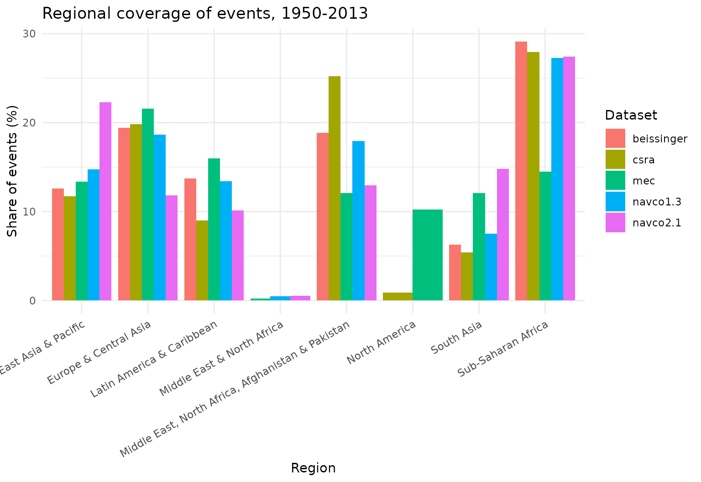
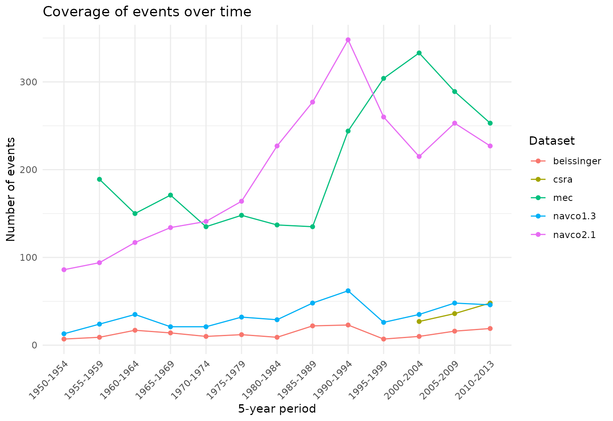
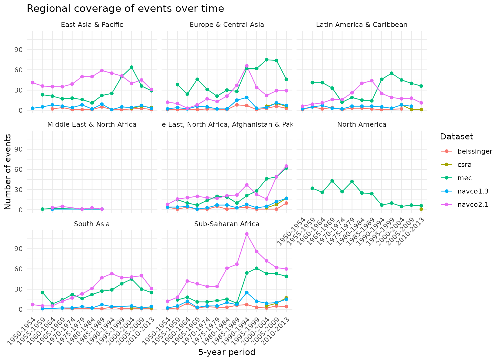
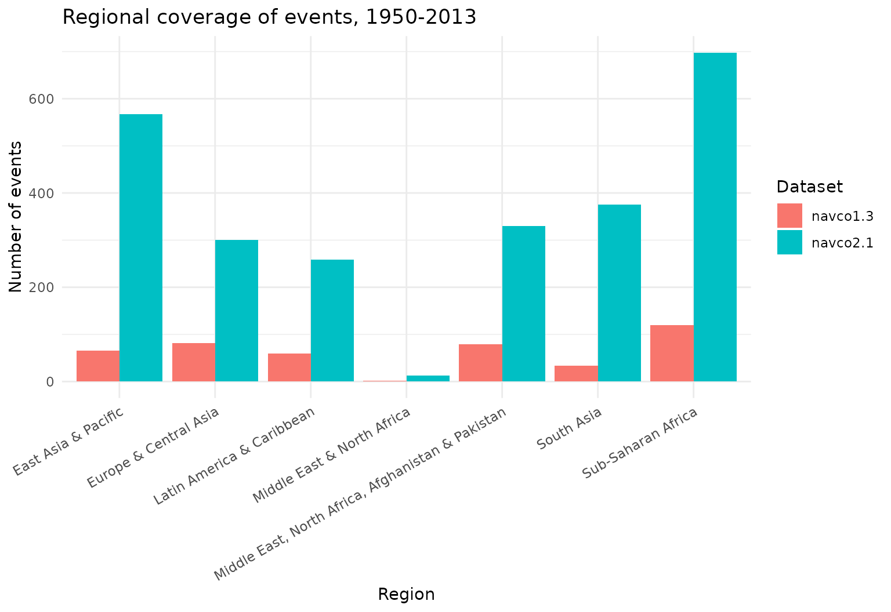

# Comparing revolutionary-event datasets

`contentiousR` bundles several campaign/episode datasets that all aim to
record the same broad phenomenon — mass anti-regime contention — but
differ in coding rules, sourcing, and scope: NAVCO 1.3, NAVCO 2.1,
Beissinger’s Revolutionary Episodes Dataset, the CSRA Revolutions
Dataset, and Major Episodes of Contention (MEC). Guseinov, Ustyuzhanin,
and Korotayev (2026) compare exactly these kinds of datasets (NAVCO
1.3/2.1, CNTS, Beissinger, CSRA, and Historical Regime Data) and find
that, while not conceptually identical, the major sources are
empirically highly convergent in their regional and temporal coverage —
CNTS being the main exception, since it appears to record coups and coup
attempts rather than the same underlying concept of revolution.

[`plot_regional_coverage()`](https://rguseinov.github.io/contentiousR/reference/plot_regional_coverage.md)
and
[`plot_temporal_coverage()`](https://rguseinov.github.io/contentiousR/reference/plot_temporal_coverage.md)
reproduce that paper’s core descriptive exercise (its Figures 1-5) for
any set of
[`conflict_data()`](https://rguseinov.github.io/contentiousR/reference/conflict_data.md)
campaign/episode datasets you choose — not a fixed pair, so you can
compare two, three, or all five at once.

## Regional coverage

For each dataset, this shows what share of its events falls in each
World Bank region (`countrycode::countrycode(..., "region")`), so
datasets of very different total size remain comparable. Pass
`metric = "count"` instead of the default `"share"` for raw counts.

``` r

library(contentiousR)

plot_regional_coverage(
  datasets      = c("navco1.3", "navco2.1", "beissinger", "csra", "mec"),
  start_year    = 1950,
  end_year      = 2013,
  coding_system = "cow"
)
```



Sub-Saharan Africa and Europe & Central Asia account for a large share
of events across every dataset here, broadly matching the source
article’s Figure 1 (drawn from NAVCO, CNTS, Beissinger, and CSRA).

## Temporal coverage

The same idea over time, binned into (by default) 5-year periods. With
`by_region = FALSE` (the default) it plots one global panel, as in the
article’s Figure 5:

``` r

plot_temporal_coverage(
  datasets      = c("navco1.3", "navco2.1", "beissinger", "csra", "mec"),
  start_year    = 1950,
  end_year      = 2013,
  coding_system = "cow"
)
```



NAVCO 2.1 and MEC sit well above the other three here. This is expected,
not a data quality problem: NAVCO 2.1 reports *campaign-years* (one row
per year a campaign remained active) rather than a single onset row per
campaign, and MEC’s underlying definition of a contentious episode is
broader — reformist as well as maximalist claims — than the “revolution”
concept the other datasets target. Mixing an onset-coded dataset with a
campaign-year-coded one in the same comparison is a legitimate choice,
but worth remembering when reading the chart.

With `by_region = TRUE`, the same data is faceted by region, as in the
article’s Figure 4:

``` r

plot_temporal_coverage(
  datasets      = c("navco1.3", "navco2.1", "beissinger", "csra", "mec"),
  start_year    = 1950,
  end_year      = 2013,
  coding_system = "cow",
  by_region     = TRUE
)
```



## Choosing your own comparison

Both functions take any subset of
[`conflict_data()`](https://rguseinov.github.io/contentiousR/reference/conflict_data.md)’s
campaign/episode datasets (`"navco1.3"`, `"navco2.1"`, `"beissinger"`,
`"csra"`, `"mec"`), so a narrower, more like-for-like comparison is just
as easy — for example, the two NAVCO versions on their own:

``` r

plot_regional_coverage(c("navco1.3", "navco2.1"), 1950, 2013, metric = "count")
```



## Reference

Guseinov, R., Ustyuzhanin, V., & Korotayev, A. (2026). Talking about the
``` math
same
```
revolution? A comparative analysis of main datasets of revolutionary
events. *Defence and Peace Economics*.
[doi:10.1080/10242694.2026.2704178](https://doi.org/10.1080/10242694.2026.2704178)
