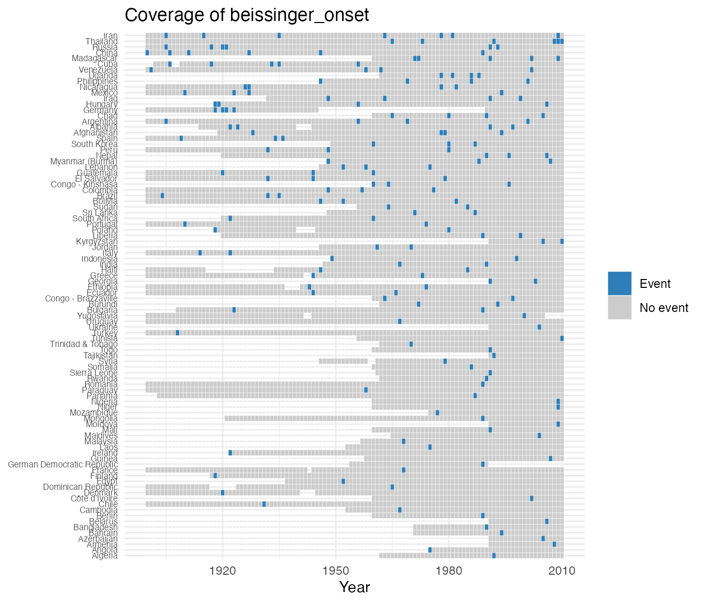

# Usage example: modeling revolutionary onset

This walks through a complete workflow with `contentiousR`: construct a
country-year panel from several sources, check its coverage, and
estimate a rare-events logit of revolutionary onset. It is rather a
demonstration of package mechanics than a substantive research claim —
the model below is illustrative and has not been vetted as a serious
specification.

## Construct the panel

\
[`library`](https://rdrr.io/r/base/library.html)`(`[`contentiousR`](https://rguseinov.github.io/contentiousR/)`)`\
[`library`](https://rdrr.io/r/base/library.html)`(`[`dplyr`](https://dplyr.tidyverse.org)`)`\
`#> Warning: package 'dplyr' was built under R version 4.5.2`\
`#> `\
`#> Attaching package: 'dplyr'`\
`#> The following objects are masked from 'package:stats':`\
`#> `\
`#>     filter, lag`\
`#> The following objects are masked from 'package:base':`\
`#> `\
`#>     intersect, setdiff, setequal, union`\
\
`panel`` ``<-`` `[`build_states_panel`](https://rguseinov.github.io/contentiousR/reference/build_states_panel.md)`(``1900``, ``2010``, coding_system ``=`` ``"cow"``)`` ``|>`\
`  `[`add_gdp`](https://rguseinov.github.io/contentiousR/reference/add_gdp.md)`(``dataset ``=`` ``"fariss"``)`` ``|>`\
`  `[`add_population`](https://rguseinov.github.io/contentiousR/reference/add_population.md)`(``dataset ``=`` ``"wpp"``)`` ``|>`\
`  `[`add_vdem`](https://rguseinov.github.io/contentiousR/reference/add_vdem.md)`(``vars ``=`` `[`c`](https://rdrr.io/r/base/c.html)`(``"v2x_polyarchy"``, ``"v2x_libdem"``, ``"v2x_execorr"``)``)`` ``|>`\
`  `[`add_leader_data`](https://rguseinov.github.io/contentiousR/reference/add_leader_data.md)`(``dataset ``=`` ``"archigos"``)`` ``|>`\
`  `[`add_military_expenditure`](https://rguseinov.github.io/contentiousR/reference/add_military_expenditure.md)`(``dataset ``=`` ``"nmc"``)`` ``|>`\
`  `[`add_conflict`](https://rguseinov.github.io/contentiousR/reference/add_conflict.md)`(``dataset ``=`` ``"beissinger"``, aggregate ``=`` ``TRUE``)`` ``|>`\
`  `[`select`](https://dplyr.tidyverse.org/reference/select.html)`(`\
`    ``cow``, ``year``, ``country``, ``fariss_gdppc``, ``wpp_pop``, ``nmc_milex``,`\
`    ``v2x_polyarchy``, ``v2x_execorr``, ``leader_tenure``, ``beissinger_onset`\
`  ``)`` ``|>`\
`  `[`mutate`](https://dplyr.tidyverse.org/reference/mutate.html)`(`[`across`](https://dplyr.tidyverse.org/reference/across.html)`(`[`starts_with`](https://tidyselect.r-lib.org/reference/starts_with.html)`(``"beissinger_"``)``, ``~`` ``tidyr``::`[`replace_na`](https://tidyr.tidyverse.org/reference/replace_na.html)`(``.x``, ``0``)``)``)`` ``|>`` ``# fill non-onsets with zeros`\
`  `[`add_spell_duration`](https://rguseinov.github.io/contentiousR/reference/add_spell_duration.md)`(``)`` ``|>`\
`  `[`add_lag`](https://rguseinov.github.io/contentiousR/reference/add_lag.md)`(`\
`    vars ``=`` `[`c`](https://rdrr.io/r/base/c.html)`(`\
`      ``"fariss_gdppc"``, ``"wpp_pop"``, ``"v2x_polyarchy"``,`\
`      ``"v2x_execorr"``, ``"leader_tenure"``, ``"nmc_milex"`\
`    ``)``,`\
`    n ``=`` ``1`\
`  ``)`\
`` #> Multiple campaigns or episodes per country-year detected in 'beissinger'. Aggregating to country-year using max() for numeric columns. Use `aggregate = FALSE` or `conflict_data()` for record-level data. ``\
\
[`dim`](https://rdrr.io/r/base/dim.html)`(``panel``)`\
`#> [1] 11257    17`

\
[`head`](https://rdrr.io/r/utils/head.html)`(``panel``)`` ``|>`\
`  `[`mutate`](https://dplyr.tidyverse.org/reference/mutate.html)`(`[`across`](https://dplyr.tidyverse.org/reference/across.html)`(`[`where`](https://tidyselect.r-lib.org/reference/where.html)`(``is.numeric``)``, ``~`` `[`round`](https://rdrr.io/r/base/Round.html)`(``.x``, ``2``)``)``)`` ``|>`\
`  ``knitr``::`[`kable`](https://rdrr.io/pkg/knitr/man/kable.html)`(``)`

| cow | year | country | fariss_gdppc | wpp_pop | nmc_milex | v2x_polyarchy | v2x_execorr | leader_tenure | beissinger_onset | beissinger_spell | fariss_gdppc_l | wpp_pop_l | v2x_polyarchy_l | v2x_execorr_l | leader_tenure_l | nmc_milex_l |
|---:|---:|:---|---:|---:|---:|---:|---:|---:|---:|---:|---:|---:|---:|---:|---:|---:|
| 2 | 1900 | United States | 17.37 | NA | 41481 | 0.42 | 0.06 | 4 | 0 | 0 | NA | NA | NA | NA | NA | NA |
| 2 | 1901 | United States | 18.07 | NA | 36087 | 0.42 | 0.06 | 1 | 0 | 1 | 17.37 | NA | 0.42 | 0.06 | 4 | 41481 |
| 2 | 1902 | United States | 18.44 | NA | 39722 | 0.42 | 0.06 | 2 | 0 | 2 | 18.07 | NA | 0.42 | 0.06 | 1 | 36087 |
| 2 | 1903 | United States | 18.69 | NA | 43814 | 0.42 | 0.06 | 3 | 0 | 3 | 18.44 | NA | 0.42 | 0.06 | 2 | 39722 |
| 2 | 1904 | United States | 18.74 | NA | 47918 | 0.42 | 0.06 | 4 | 0 | 4 | 18.69 | NA | 0.42 | 0.06 | 3 | 43814 |
| 2 | 1905 | United States | 19.34 | NA | 45098 | 0.42 | 0.06 | 5 | 0 | 5 | 18.74 | NA | 0.42 | 0.06 | 4 | 47918 |

`add_conflict(dataset = "beissinger", aggregate = TRUE)` is used rather
than `aggregate = FALSE`: Revolutionary Episodes Dataset is an episode
dataset, and a handful of country-years have more than one recorded
episode (e.g. Germany in 1918). Left unaggregated, those country-years
would produce duplicate `cow`-`year` rows. `replace_na(0)` treats “not
covered” as “no onset” so that
[`add_spell_duration()`](https://rguseinov.github.io/contentiousR/reference/add_spell_duration.md)
(which cannot span `NA`) can compute a peace-years counter
(`beissinger_spell`) across the whole panel. This is a modeling choice,
not a neutral default.

## Check coverage

\
[`plot_coverage`](https://rguseinov.github.io/contentiousR/reference/plot_coverage.md)`(``panel``, ``"beissinger_onset"``, drop_empty ``=`` ``TRUE``)`

## Model onset

Onsets are rare, which biases a regular logit model. The model below
uses `brglm2`’s Jeffreys-prior penalized likelihood
(`method = "brglmFit"`, `type = "MPL_Jeffreys"`) instead (see Kosmidis
and Firth 2009), with a natural spline on `beissinger_spell` to flexibly
control for time since the last episode and year fixed effects. One-year
lagged controls are included in the estimation.

\
[`library`](https://rdrr.io/r/base/library.html)`(`[`brglm2`](https://github.com/ikosmidis/brglm2)`)`\
`#> Warning: package 'brglm2' was built under R version 4.5.2`\
\
`model`` ``<-`` `[`glm`](https://rdrr.io/r/stats/glm.html)`(`\
`  ``beissinger_onset`` ``~`` `[`log`](https://rdrr.io/r/base/Log.html)`(``fariss_gdppc_l`` ``+`` ``0.1``)`` ``+`` ``wpp_pop_l`` ``+`\
`    ``v2x_polyarchy_l`` ``+`` `[`I`](https://rdrr.io/r/base/AsIs.html)`(``v2x_polyarchy_l``^``2``)`` ``+`` ``v2x_execorr_l`` ``+`\
`    ``leader_tenure_l`` ``+`` `[`I`](https://rdrr.io/r/base/AsIs.html)`(``leader_tenure_l``^``2``)`` ``+`` ``nmc_milex_l`` ``+`\
`    ``splines``::`[`bs`](https://rdrr.io/r/splines/bs.html)`(``beissinger_spell``, ``3``)`` ``+`` `[`as.factor`](https://rdrr.io/r/base/factor.html)`(``year``)``,`\
`  family ``=`` `[`binomial`](https://rdrr.io/r/stats/family.html)`(``"logit"``)``,`\
`  method ``=`` ``"brglmFit"``, type ``=`` ``"MPL_Jeffreys"``,`\
`  data ``=`` ``panel`\
`)`\
\
`co`` ``<-`` `[`summary`](https://rdrr.io/r/base/summary.html)`(``model``)``$``coefficients`\
`co``[``!`[`grepl`](https://rdrr.io/r/base/grep.html)`(``"factor\\(year\\)"``, `[`rownames`](https://rdrr.io/r/base/colnames.html)`(``co``)``)``, ``]`\
`#>                                        Estimate   Std. Error     z value`\
`#> (Intercept)                       -5.550567e+00 1.498395e+00 -3.70434260`\
`#> log(fariss_gdppc_l + 0.1)         -7.386937e-03 1.005935e-01 -0.07343355`\
`#> wpp_pop_l                          7.754770e-07 5.522362e-07  1.40424860`\
`#> v2x_polyarchy_l                    4.423945e+00 1.702073e+00  2.59915126`\
`#> I(v2x_polyarchy_l^2)              -7.632799e+00 2.111169e+00 -3.61543769`\
`#> v2x_execorr_l                      9.793513e-01 3.745080e-01  2.61503398`\
`#> leader_tenure_l                    4.100986e-02 3.083965e-02  1.32977723`\
`#> I(leader_tenure_l^2)              -1.280561e-03 9.790682e-04 -1.30793877`\
`#> nmc_milex_l                        1.130478e-09 4.262518e-09  0.26521368`\
`#> splines::bs(beissinger_spell, 3)1 -9.704602e-01 9.016502e-01 -1.07631553`\
`#> splines::bs(beissinger_spell, 3)2  1.816522e+00 1.149644e+00  1.58007360`\
`#> splines::bs(beissinger_spell, 3)3 -5.650164e-02 1.385542e+00 -0.04077944`\
`#>                                       Pr(>|z|)`\
`#> (Intercept)                       0.0002119397`\
`#> log(fariss_gdppc_l + 0.1)         0.9414611236`\
`#> wpp_pop_l                         0.1602448342`\
`#> v2x_polyarchy_l                   0.0093454584`\
`#> I(v2x_polyarchy_l^2)              0.0002998406`\
`#> v2x_execorr_l                     0.0089218579`\
`#> leader_tenure_l                   0.1835916809`\
`#> I(leader_tenure_l^2)              0.1908940772`\
`#> nmc_milex_l                       0.7908448601`\
`#> splines::bs(beissinger_spell, 3)1 0.2817861642`\
`#> splines::bs(beissinger_spell, 3)2 0.1140900124`\
`#> splines::bs(beissinger_spell, 3)3 0.9674717277`

Year fixed effects are omitted from the printed table above for
readability.

## Reference

Kosmidis, I., and D. Firth. 2009. “Bias Reduction in Exponential Family
Nonlinear Models.” Biometrika 96 (4): 793–804.
<https://doi.org/10.1093/biomet/asp055>.
